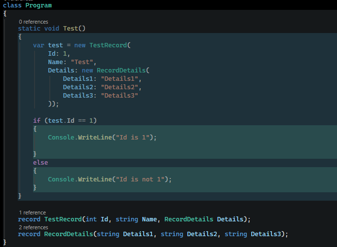
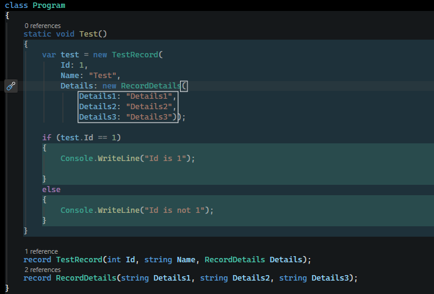
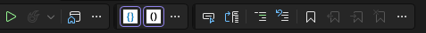

# VisualStudioReadabilityExtension

A Visual Studio extension that shades the background of every `{ … }` code block by its
nesting depth, so brace scopes are visible at a glance. The fills are translucent, so
nested blocks stack and grow progressively darker.

It also outlines the **active scope** — the parenthesis pair `( … )` that currently contains
the caret — with a solid line, like VS Code's Bracket Pair Colorization. (The depth fills
track curly braces `{ }`; the active outline tracks parentheses.) The outline is drawn on top
of the depth fills so it stands out, and follows the caret as you move around.





### Command-line build

```
msbuild VisualStudioReadabilityExtension.sln /t:Restore /p:Configuration=Release
msbuild VisualStudioReadabilityExtension.sln /t:Build   /p:Configuration=Release
```

The `.vsix` lands in `VisualStudioReadabilityExtension\bin\Release\VisualStudioReadabilityExtension.vsix`, doubleclick to install.

To enable the toolbar buttons open **Tools → Customize → Check "Readability"**. 
Two buttons are added, one for code block coloring and one for parenthesis grouping.



## Configuring

Open **Tools → Options** and go to **VisualStudioReadabilityExtension**.

- **Code view background colour** — hex; default `#000000` (pure black).
- **Opacity (%)** — tint strength (1–100).
- **Number of depths to colour** — 0 = all depths; e.g. 3 tints only the first three levels.
- **Active scope outline colour** — in hex hex (i.e. `#FFFFFF`).
- **Active scope outline thickness** — line width in pixels (1–10).
- **Depth 1 … Depth 7 colour** — the base colour for each nesting level, entered as a
  `#RRGGBB` hex string. Depth 8+ cycles back to Depth 1.
